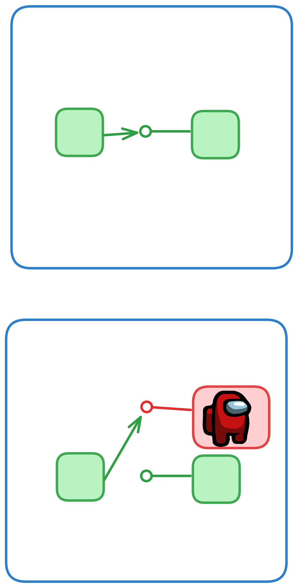
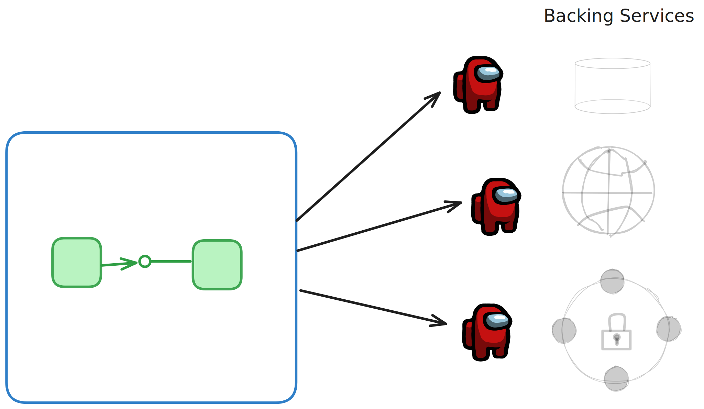

# Test Doubles for Developer Confidence

> "Meszaros uses the term Test Double as the generic term for any kind of pretend object used in place of a real object for testing purposes. The name comes from the notion of a Stunt Double in movies." [Martin Fowler, "Mocks Aren't Stubs](https://martinfowler.com/articles/mocksArentStubs.html)

So, any kind of "pretend thing used in place of a real thing for testing purposes" is how I define "test double". My apologies to Martin Fowler, but I prefer the way more technical word "thing" over his "object". ;) 

The emphasis in the course/content is going to be using test doubles as stand-ins for the backing services our appliction relies upon. 

In the following illustration, the top part shows the relationship between two units of code. One unit uses the *interface* of another unit to do some work at runtime.

The second part shows a "test double" being used (without the knowledge of the code we are testing) to verify the code we are testing is using, interacting with, and/or responding to the functionality of the dependency - the imposter. By using a test double we can have various scenarios we can test against.

The blue box in this diagram represents the process boundary. Our running application.

In this training we are going to emphasise almost solely using test doubles for things that live outside that process boundary. We will call these [Backing Services](https://12factor.net/backing-services) and they could be databases, external APIs, file systems, identity providers, etc.

