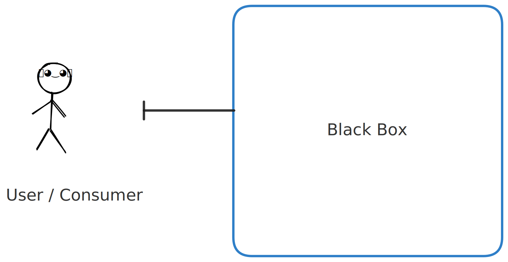
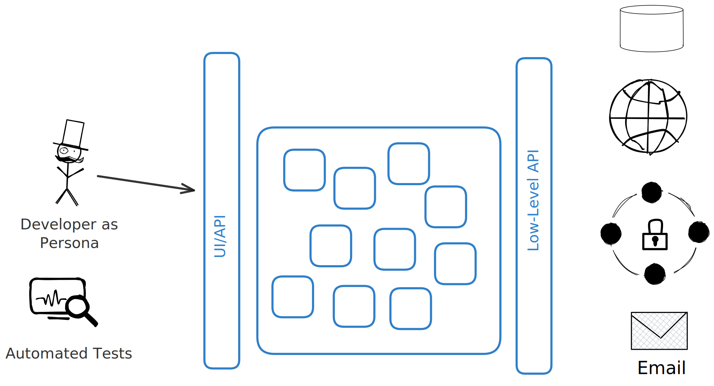

# Rationale

This its a little *philosophical* background that underlies some of the thinking in this style of development.

## Things That Drive Our Application

Every application is *driven* by one or more *agents* and they almost always have some kind of *outputs*. 

Your application may be *driven* by something like the clock (as in a cron job, for example), or a file being updated in a certain directory it is watching. 

> See [Functional Event Sourcing Decider](https://thinkbeforecoding.com/post/2021/12/17/functional-event-sourcing-decider) and [Functional Core, Imperative Shell](https://www.destroyallsoftware.com/screencasts/catalog/functional-core-imperative-shell) for a deeper look at this way of thinking about software.

Most applications, though, expose their functionality through an *interface*. An interface, according to the Oxford Languages dictionary via a Google search is defined as "a point where two systems, subjects, organizations, etc. meet and interact.". Some interfaces are *user interfaces* (UI), and some are programmatic interfaces used by software to interact with other software (API).

No matter the type of interface, the purpose is largely to ***allow the user or the system to do something we want them to do***. This is particularly true in *application development*, where we are leveraging general-purpose technology for a specific business purpose. 

Interfaces Should (amongst other things):

- **Hide complexity** from the user. For example, when I move an appointment on my Google Calendar from one day to the next, I don't need to know - nor really want to know - what all the marvelous things that are going on behind the scenes to make that possible. Or when I hit "buy now" on Amazon, I just want the order delivered (and they want my money). In order to hide complexity (which also reduces coupling), the interface has to be *consumer focused*, as opposed to *technology focused*. If I'm using a programmatic library to run queries against a database, for example, I want to be able to give it some information about my database and call methods that `open` and `close` that connection, without having to dust off my old TCP/IP text books to understand the nuances of network communication.
- **Provide stability while evolving** - Most applications *still* use an icon of a 3.5" disk to indicate that clicking that icon will save the file. There are a lot of (usually younger) people that don't know that that icon has a real-world referent. It just means "save". Why is it still the same, even though we no longer save to disks like that? Stability. If they suddenly changed it to something else, people would *freak out*. At the same time, new functionality has to be added, sometimes functionality has to be removed, or changed; in other words, our system has to evolve.

Our users or software using our interface (I'll start using the term *consumer* here to just mean "the human or software using our interface") want, mostly, to see our interface, our API, our UI as a sort of black box.

We as software developers know, however, there is a *lot* of complexity happening inside that. If the box were *clear* it might look something like this:

## About Automated Tests

Super important, right? Essential even. A huge part of my work as both a developer and a teacher is testing software with automated tests. 

I am not saying *anything* against software testing here. Do *not* (please!) send the legions of the TDD fanatics after me. However, there can be a *shadow side* of building software driven by automated tests. I'm not going to get on my soapbox too long here, but there are a few things that I think are important to mention.

1. **Manual (non-automated) Testing is Testing** and is important and valuable as a developer. Developing your interface (API, UI) by *touching* it as the consumer of your application will puts you in *their* headspace. While you can get some sense of this by writing tests for your code, I've seen many developers (myself included) get subtly influenced by their tests. We all have integrity, but I have noticed times when, in the development of some interface, I'm much less likely to make a change to it that I think would improve the experience of the consumer if I *also* have to change a bunch of tests. I find this particularly true in user interface development. UI is almost more an *art* than a *science*. You almost always have to *iterate* on a UI until it feels "right". This can also be true with APIs as well. 
2. **Unit Tests Are (usually) Not the Place to Start** - this is almost 100% true if you are an *application developer*. If you are working in another sphere of development (doing general systems programming, or building libraries or frameworks) unit tests have more value. Unit Tests (tests that test a single *unit* of application functionality in isolation from other dependencies) are "clear box" tests. They break the encapsulation of your code. They "know how the bread is buttered" at some level or another. If you change (read: evolve) your code, you will almost certainly have to "fix" your tests as well. Building specific-purpose apps (like web applications, or HTTP APIs) should not be built with the same techniques and disciplines of general purpose code. You *should* write unit tests for the portions of your code that have a high level of *algorithmic complexity* that can't be adequately verified through exercising the interface the consumer will use that relies on that code. For example, maybe you are working in e-commerce and you have to take credit cards numbers. You want to implement the [Luhn Algorithm](https://en.wikipedia.org/wiki/Luhn_algorithm) to verify that the card number provided does not have typos in it. That's a good place for some unit tests. Basically, I want you to write *just as many* or *more* tests than you currently write, but they should be more *meaningful* tests. 
3. **Most Unit Tests Get Hellish With Dependencies** - Unit Tests should *not* reach outside of your process space. They shouldn't touch networks, databases, file systems, interact with users, or even rely on the clock. Unit tests are *functional* tests in that they prove that your code under test is a "pure function". Given a set of inputs, your code will *always* produce the same output. What if the code you are testing (your "System Under Test" or "SUT") does need to do one of those "impure" things like network calls? You have to fake it. Create *test-doubles* that stand-in for those things. I can't imagine how many hours have been wasted with *application developers* doing things like "mocking the HTTP Client", or "How do I mock an Entity Framework DataContext class?". And what happens when the vendor for those things changes them? Now you are fixing tests because of someone *elses* code changing.

> [!WARNING] 
> The more general purpose your code is, the more you'll have to write unit tests and use test-doubles for dependencies. Application development is the *opposite* of writing general-purpose code. If you are creating reusable UI libraries for others at your company, you'll need a different testing strategy. If you are writing libraries or frameworks used by various (read: general) folks, you'll need more unit tests. Even within your own application, code that "grows up" to be what [Matt Pocock](https://www.mattpocock.com/) calls to be "Utility Folder" stuff, you might need more tests. But even having said all of that, I *still* advise starting with testing from the consumer-focused interface of your application. 

> A couple of resources that really helped me develop my thinking around this, in no particular order, are [Outside In TDD by Mark Seemann](https://www.pluralsight.com/courses/outside-in-tdd), [Growing Object-Oriented Software Guided by Tests](https://www.amazon.com/Growing-Object-Oriented-Software-Guided-Tests/dp/0321503627), and, more recently, [Kent Dodd's Testing Trophy](https://kentcdodds.com/blog/the-testing-trophy-and-testing-classifications)

For these reasons this content is going to focus on using test doubles, but, importantly, primarily test doubles you can use while you are manually testing your application. In other words, building it. Thinking through it. Scratching your chin and looking out the window and thinking *what if?*

> [!NOTE]
> What I'm talking about here is the *essential* task of a developer. Your essential task is not typing code, writing tests, building pipelines, writing documentation, or going to meetings. Our essential task is "the fashioning of the complex conceptual structures that compose the abstract software entity" [No Silver Bullet, Fred Brooks](https://www.cs.unc.edu/techreports/86-020.pdf)

Now, having said all that all, each of the things covered here will help you (and largely be reusable) when you write automated tests. Each of the techniques I will show can be adapted to almost any software development tool/framework/library/language. 
